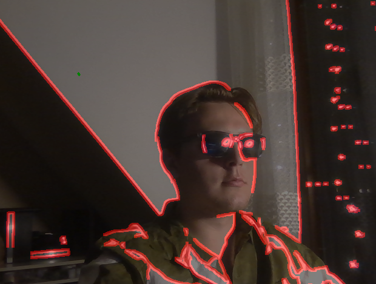

# DualShot

DualShot jest niezwykłą aplikacją wielowątkową, której potrzebuje każdy posiadacz komputera. 

## Działanie aplikacji z puntku widzenia użytkownika 
Aplikacja pobiera obraz z kamery komputera (należy się upewnić, że komputer użytkownika takową posiada) i wyświetla go w niedużym okienku na ekranie. Następnie wykrywa na pobranym obrazie krawędzie i dodaje je do wyświetlanego podglądu z kamery (np. krawędzie naszego ciała, krawędzie obrazu wiszącego na ścianie). Aplikacja również dodaje do obrazu piłkę, która porusza się i odbija od wyświetlonych krawędzi. 

Oto przykład, jakie efekty można uzyskać:

## Budowa aplikacji
Aplikacja jest wielowątkowa. Bazuje na bibliotekach __OpenCV__ oraz __threading__. Pierwsza biblioteka służyu do pobierania oraz przetwarzania obrazu. Druga zaś jest niezbędna do zarządzania wszystkimi procesami. 

W naszej aplikacji zostały zaimplementowane dwa wątki:
- __CameraThread__ służący do pobierania na bieżąco obrazu z kamery komputera
- __EdgeDetectionThread__ - w czasie rzeczywistym wykrywa oraz wykreśla na wyświetlanym obrazie z kamery krawędzie. 

